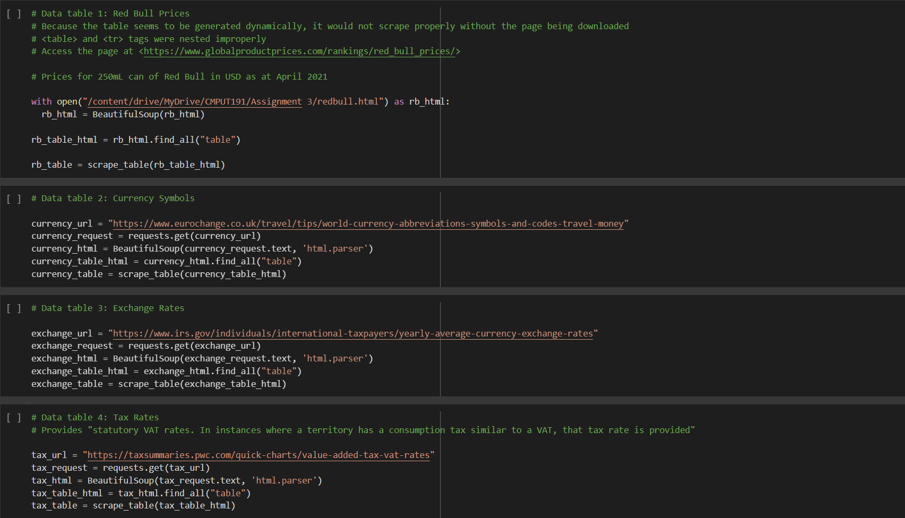

# CMPUT 191 Assignment 3

The goal of the assignment was to examine the concept of purchasing power parity. Similar to the Big Mac index tool that examines the same concept, we created a similar index that instead examines the prices of Red Bull by country.

Let's start by creating a few user defined functions:

These functions make displaying and scraping tables more efficient, and was the first cell we coded incase we needed to display or scrape multiple tables.

Next we create our tables:

