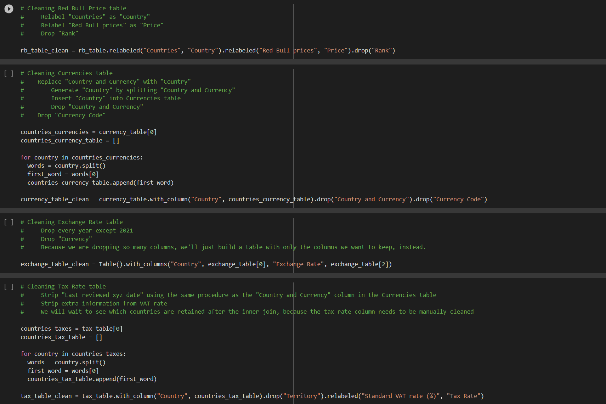
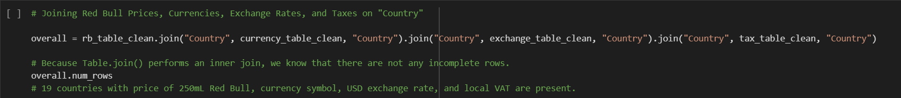
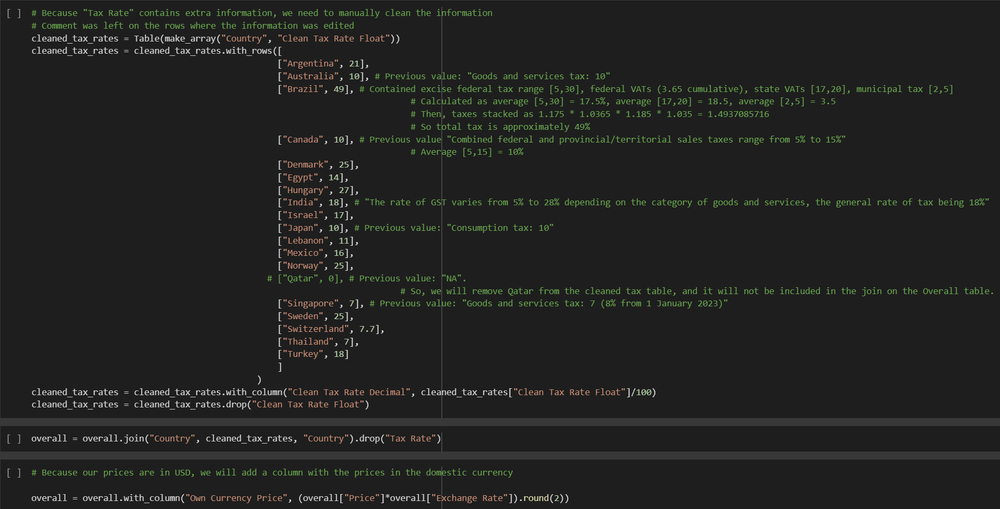
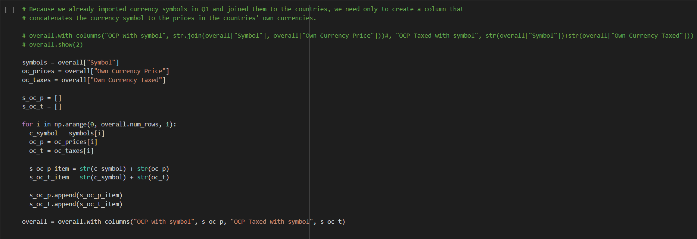
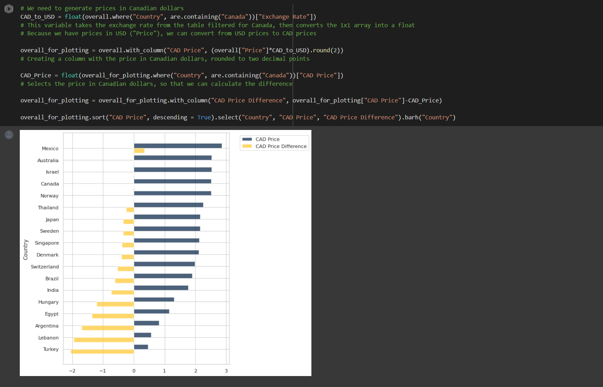
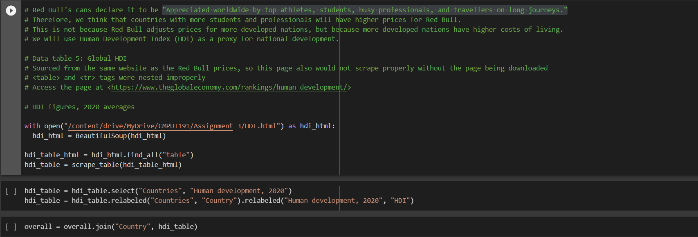
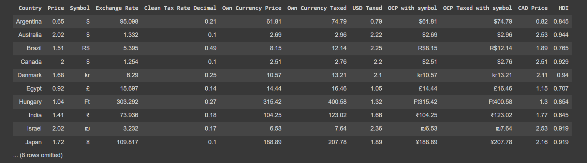
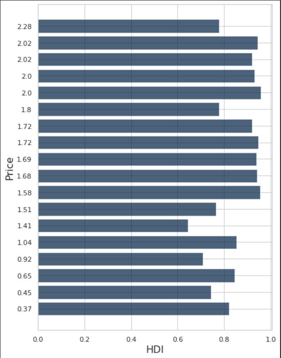
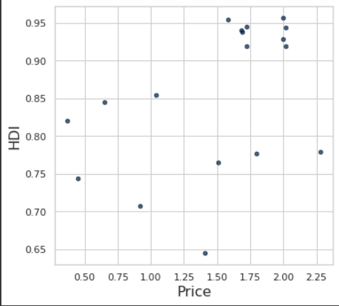

# CMPUT 191 Assignment 3

The goal of the assignment was to examine the concept of purchasing power parity. Similar to the Big Mac index tool that examines the same concept, we created a similar index that instead examines the prices of Red Bull by country.

Let's start by creating a few user defined functions:

These functions make displaying and scraping tables more efficient, and was the first cell we coded incase we needed to display or scrape multiple tables.

Next we create our tables:

We decided to first make a seperate table for each of the columns we needed, with the rationale that it would make cleaning and tidying up data further on more efficient. The first table includes Red Bull prices by country, followed by another table for country currencies and their respective currency codes, then another of exchange rates between countries, and finally one table for country tax rates.

Then we clean our data:

First all the tables need to be normalized, relabelled, and formatted. The process involves relabelling columns, dropping any columns that are not needed, stripping, and splitting values (described in depth in the code cell comments). After tidying up our tables, we join them together to make one full table.

Of course, there were unexpectedly some issues:

Because our tax rate table contained extra information, it had to be manually cleaned. With comments made in the code cell for rationales of specific value changes.
Once our tax rates were cleaned, we reformatted our columns again and added another column for prices in domestic currency to complete cleaning and tidying our data. Finally we have a single table with:
  - 18 total countries
  - Red Bull prices (250mL can, USD)
  - Currency symbol
  - Exchange rate to USD (2021 average)
  - Tax rate (%)
  - Price in own currency

To complete the bonus we took our completed table, added a column for local tax rates, and for the dataset we multiplied the countrys' own currency price by the cleaned tax rate (decimal), added 1, and rounded the result. A similar process was done to show USD tax.

As we already imported currency symbols earlier, we only need to create a column that concatenates the symbol to the respective prices. We did this with a loop that generated what we needed as strings which were then appened to a list and used as the dataset to insert into the table.

For this task, we first generated the prices in CAD using the USD prices we already had. From there we formatted and then displayed CAD price and CAD price difference in a bar chart.

For Q6 we decided to look at the Human Development Index (HDI), as Red Bull themselves claim that their product is, "Appreciated worldwide by top athletes, students, busy professionals, and travellers on long journeys." By looking at HDI, our hypothesis is that countries with more students and professionals will have higher prices for Red Bull.

Our code was fairly straightforward, as we first scraped the HDI data, cleaned it, then put it in our finished table from earlier.

Here is a table with our HDI column:

Bar chart:

Scatter:

After creating an index comparing the prices of Red Bull between countries globally, we've come to the conclusion that the price of Red Bull is not consistent throughout the world. We determined that the lowest price Red Bull of the countries we examined to be Turkey, with Mexico having the highest price. Furthermore, after examining the human development index as a factor for this price deflation/inflation, we also came to the conclusion that HDI seems to not have an influence on the price of Red Bull in a particular country. The greatest difficulty, aside from planning our approach to the assignment, was manually cleaning the tax rate data early on. 
