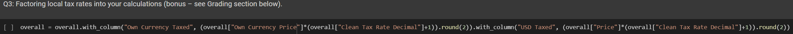

# CMPUT 191 Assignment 3

The goal of the assignment was to examine the concept of purchasing power parity. Similar to the Big Mac index tool that examines the same concept, we created a similar index that instead examines the prices of Red Bull by country.

### Purchasing Power Parity
* "The rates of currency conversion that try to equalize the purchasing power of different currencies, by eliminating the different price levels between countries (OECD) (https://data.oecd.org/conversion/purchasing-power-parities-ppp.htm)
* Macroeconomic analysis measure
* Can be used to predict and forecast exchange rates, create economic policy, and examine real changes in foreign exchange securities and derivatives
* Can also be used to normalise GDP figures

### Why a Red Bull Index?
* Red Bull is the archetype brand of the energy drink market, having created the market when it first released its product in 1987. Over 10 billion cans have been sold since (https://www.redbull.com/int-en/energydrink/red-bull-is-safe)
* Red Bull is also the most valuable energy drink brand in the world, according to Interbrand (https://interbrand.com/best-global-brands/red-bull/), and uses premium positioning to resist price adjustments due to competing brands

## Our Analysis

### Creating functions

Let's start by creating a few user defined functions, which we drew from labs and assignments:

These functions make displaying and scraping tables more efficient, and was the first cell we coded.

### Importing Data

Next we create our tables:

We imported our tables separately for the data needed, with the rationale that data cleaning would be easier on separate tables we joined later on. 
* The first table includes Red Bull prices in USD by country (250mL can as at April 2021)
* The second table gives country currencies and their codes and symbols
* The third table contains exchange rates between countries' currencies and USD
* The final table contains countries' goods and services/value-added taxes rates

### Data Clean

We then cleaned our data:

Tables needed to be relabelled and formatted. The following cleans were made: 
#### Red Bull Price Table: 
* "Countries" column was relabelled as "Country"
* "Red Bull Prices" column was relabelled as "Price"
* "Rank" was dropped

#### Currencies Table:
* "Country and Currency" was replaced with "Country". A for loop was used to split the country off the currency name, and then reinserted into the table
* "Currency Code" was dropped

#### Exchange Rate Table:
* Every year of exchange rates were dropped except 2021 (we actually just made a new table from the one column)
* "Currency" was dropped (we only needed countries)

#### Tax Rate Table
* We stripped the phrase "Last reviewed XYZ dat" using the same procedure as the currencies table
* We also had to manually clean extra information (notes) from the tax rates, but we waited to see which countries would be retained after the join.

Of course, there were unexpectedly some issues:

Because our tax rate table contained extra information, it had to be manually cleaned. With comments made in the code cell for rationales of specific value changes.
Once our tax rates were cleaned, we reformatted our columns again and added another column for prices in domestic currency to complete cleaning and tidying our data. Finally we have a single table with:
  - 18 total countries
  - Red Bull prices (250mL can, USD)
  - Currency symbol
  - Exchange rate to USD (2021 average)
  - Tax rate (%)
  - Price in own currency

To complete the bonus we took our completed table, added a column for local tax rates, and for the dataset we multiplied the countrys' own currency price by the cleaned tax rate (decimal), added 1, and rounded the result. A similar process was done to show USD tax.

As we already imported currency symbols earlier, we only need to create a column that concatenates the symbol to the respective prices. We did this with a loop that generated what we needed as strings which were then appened to a list and used as the dataset to insert into the table.

For this task, we first generated the prices in CAD using the USD prices we already had. From there we formatted and then displayed CAD price and CAD price difference in a bar chart.

For Q6 we decided to look at the Human Development Index (HDI), as Red Bull themselves claim that their product is, "Appreciated worldwide by top athletes, students, busy professionals, and travellers on long journeys." By looking at HDI, our hypothesis is that countries with more students and professionals will have higher prices for Red Bull.

Our code was fairly straightforward, as we first scraped the HDI data, cleaned it, then put it in our finished table from earlier.

Here is a table with our HDI column:

Bar chart:

Scatter:

After creating an index comparing the prices of Red Bull between countries globally, we've come to the conclusion that the price of Red Bull is not consistent throughout the world. We determined that the lowest price Red Bull of the countries we examined to be Turkey, with Mexico having the highest price. Furthermore, after examining the human development index as a factor for this price deflation/inflation, we also came to the conclusion that HDI seems to not have an influence on the price of Red Bull in a particular country. The greatest difficulty, aside from planning our approach to the assignment, was manually cleaning the tax rate data early on. 
